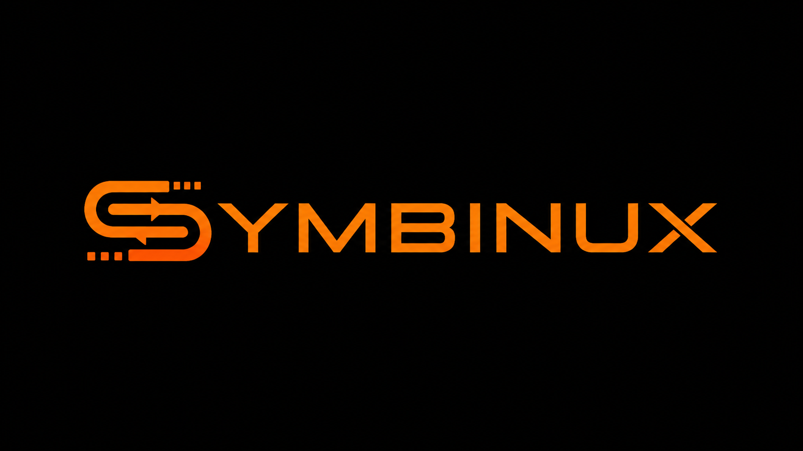

# Symbinux

<picture>
  <source media="(prefers-color-scheme: dark)" srcset="assets/logo/symbinux_logo_white.png">
  
</picture>

Tool moderno per la gestione di dispositivi USB e Bluetooth su GNU/Linux,
con architettura **Core + GUI** separata e pacchettizzazione Flatpak.

**Symbinux è un fork dichiarato di [Nokinux](https://launchpad.net/nokinux)**
(2008-2010), progetto Bash/Python nato in seno alla comunità Ubuntu italiana
per configurare cellulari Nokia da Linux, di cui Davide Pica (davidebr90) è
stato tra gli autori originali insieme ad altri contributori. Lo scopo di
Nokinux è ormai superato dall'evoluzione dei dispositivi mobili; Symbinux ne
riprende il nome e lo spirito riscrivendolo da zero secondo gli standard
applicativi Linux attuali (architettura Core + GUI separata, packaging
Flatpak) e generalizzandone lo scopo alla gestione di qualsiasi dispositivo
USB/Bluetooth moderno.

## Architettura

```
symbinux/
├── core/           # symbinux.core - libreria pura, nessuna dipendenza GUI
│   ├── devices.py  # rilevamento USB (pyudev)
│   └── bluetooth.py# integrazione Bluetooth (BlueZ via D-Bus)
├── gui/            # symbinux.gui - frontend GTK4 + libadwaita
│   ├── main.py
│   └── window.py
├── packaging/
│   └── flatpak/    # manifest Flatpak per la distribuzione
├── tests/
└── pyproject.toml
```

Il Core è una libreria Python indipendente e testabile via CLI/headless.
La GUI è un layer separato che consuma il Core: nessuna logica di business
nella GUI, nessuna dipendenza GTK nel Core.

## Requisiti

- Python >= 3.11
- Linux con `udev` e (opzionale) `bluez` per le funzionalità reali
- Per la GUI: GTK4 e libadwaita (`gir1.2-gtk-4.0`, `gir1.2-adw-1` su Debian/Ubuntu)

## Sviluppo

```bash
python -m venv .venv
source .venv/bin/activate
pip install -e ".[gui,dev]"

# Solo core (headless, niente dipendenze GUI)
pip install -e .

# Test
pytest
```

## Nota sull'ambiente di sviluppo

Il Core e la GUI dipendono da librerie Linux (`pyudev`, GTK4/libadwaita via
D-Bus/GObject) e **non girano su Windows**. Lo sviluppo/test va fatto su una
macchina Linux reale o in **WSL2** con un ambiente desktop (o X11/Wayland
forwarding).

## Packaging

Il manifest Flatpak si trova in `packaging/flatpak/`. Build locale:

```bash
flatpak-builder build-dir packaging/flatpak/it.davidebr90.Symbinux.yml --force-clean
```

## Licenza

GPLv3, in continuità con la licenza del progetto originale Nokinux.
Vedi [LICENSE](LICENSE).

## Changelog

Vedi [CHANGELOG.md](CHANGELOG.md).
