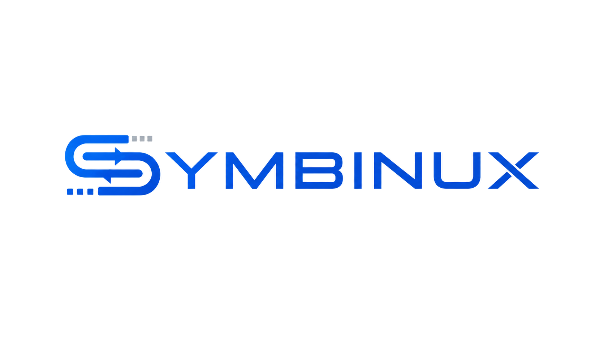

# Symbinux

<picture>
  <source media="(prefers-color-scheme: dark)" srcset="assets/logo/symbinux_logo_transparent_dark.png">
  
</picture>

*[Leggi questo documento in italiano](README.it.md)*

Talk to legacy Nokia phones from a modern GNU/Linux desktop. Symbinux is a
clean-room implementation of the Nokia **FBUS/MBUS** serial protocols over USB
(with a serial-cable path today and raw-USB/BB5 on the roadmap), packaged as a
Rust core + CLI with a GTK4/libadwaita GUI.

**Symbinux is a declared fork of [Nokinux](https://launchpad.net/nokinux)**
(2008-2010), a Bash/Python project born in the Italian Ubuntu community to
configure Nokia phones from Linux, of which Davide Pica (davidebr90) was one of
the original authors alongside other contributors. Symbinux carries its name and
spirit forward, rewritten from scratch to today's standards.

The protocol is reconstructed from the open-source **gnokii** and **gammu**
projects and validated against documented real captures. It uses **no
proprietary Nokia code, libraries or binaries**.

## What it does

- **Identify** a phone (model, IMEI, hardware and firmware version).
- **Phonebook** read (and experimental write) across ME/SIM memory.
- **Netmonitor** diagnostics.
- **SMS** read/send (experimental).
- **Advanced device inventory** — an lsusb-style view of everything connected
  (VID:PID, extended names, classification) to debug detection issues.
- **Raw frame mode** for protocol reverse-engineering.

See [docs/FUNCTIONS.md](docs/FUNCTIONS.md) for the full reference and safety
classes.

## Architecture

```
symbinux/
├── crates/                     # Rust workspace (the core)
│   ├── symbinux-protocol/      # FBUS/MBUS framing — pure, no I/O, fully tested
│   ├── symbinux-transport/     # serial (termios) + raw USB (libusb), enumeration
│   └── symbinux-cli/           # `symbinux-fbus` gnokii-style command-line tool
├── src/symbinux/               # GTK4 + libadwaita GUI (Python), calls the CLI
├── udev/                       # unprivileged-access rules
├── data/devices.json           # known VID/PID table (community-maintained)
├── docs/                       # PROTOCOL_NOTES / FUNCTIONS / ROADMAP / SETUP
└── packaging/flatpak/          # Flatpak manifest
```

Layers are strictly separated: framing (no I/O) → transport (I/O) → CLI → GUI.
The GUI holds no protocol logic; it shells out to `symbinux-fbus`.

## Quick start

```bash
# Core + CLI
cargo build --release

# What is connected right now (no phone required):
target/release/symbinux-fbus devices --all

# Identify a phone over a DKU-2/CA-42 cable:
target/release/symbinux-fbus identify --port /dev/nokia_fbus

# GUI
pip install -e ".[gui]"
symbinux
```

Unprivileged access (no `sudo` in normal use) is a one-time udev install — see
[docs/SETUP.md](docs/SETUP.md).

## Requirements

- Rust ≥ 1.74, `libusb-1.0`, `pkg-config`.
- For the GUI: Python ≥ 3.11, GTK4 and libadwaita (`gir1.2-gtk-4.0`,
  `gir1.2-adw-1` on Debian/Ubuntu).
- A real Linux machine, or WSL2 with USB passthrough for hardware tests. The
  protocol codec is fully testable with no hardware (`cargo test`).

## Tests

```bash
cargo test        # protocol codec against real-capture fixtures + transport
pytest            # Python GUI/backend
```

## Safety

Firmware/flash writes are **not implemented** and are refused. Only read commands
run by default; anything that modifies the phone is opt-in, and raw-frame mode is
gated behind an explicit flag. Details in
[docs/PROTOCOL_NOTES.md](docs/PROTOCOL_NOTES.md).

## License

**GNU AGPLv3** (or later). See [LICENSE](LICENSE). This is compatible with the
GPL/LGPL of the gnokii/gammu documentation the protocol notes draw on.

## Changelog

See [CHANGELOG.md](CHANGELOG.md).
